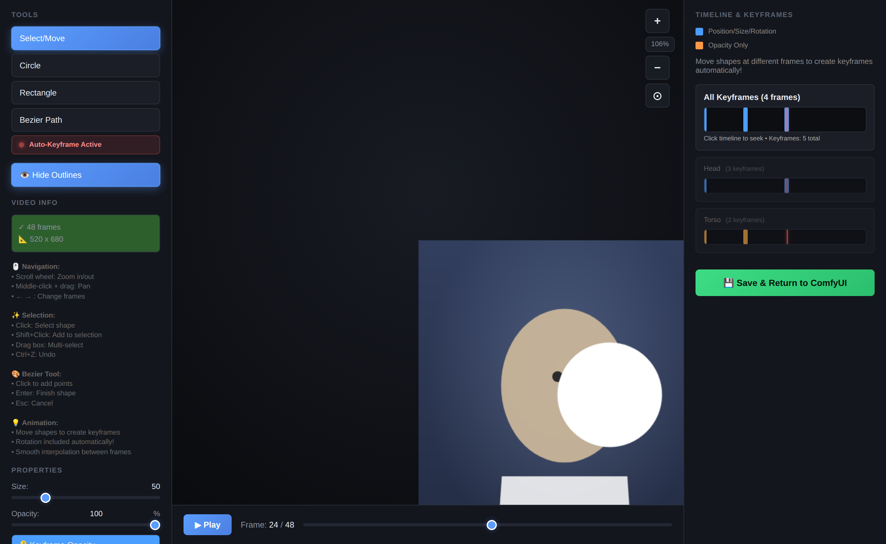

# ComfyUI – Animated Mask Editor 🎨

A ComfyUI custom node for drawing **animated, keyframed masks** directly on your video / image batch — with a full-screen, Roto-style editor that launches right from the node. Draw circles, rectangles and bézier shapes, move them across frames to keyframe them automatically, and export a frame-accurate mask sequence for inpainting, effects, compositing or video editing.

Shapes are **persistent**: they serialize into your workflow (and a disk backup), so your roto survives restarts and travels with the `.json`.

---

## ✨ Features

- 🖌️ **Interactive editor** — Circle, Rectangle and Bézier (free-form) shapes on a zoomable, pannable canvas overlaid on your real video frames.
- 🎞️ **Automatic keyframing** — move/resize/rotate a shape on a different frame and a keyframe is created; values interpolate smoothly in between.
- 🟦🟧 **Readable timeline** — position/size/rotation keyframes are **blue**, opacity-only keyframes are **orange**.
- 🌫️ **Feathering & invert** — soft edges and one-click mask inversion.
- 💾 **Persistent masks** — stored in the workflow + a per-node disk backup, so nothing is lost on restart.
- 🔌 **Three outputs** — the mask sequence plus two ready-to-view preview overlays.

---

## 🖥️ The Editor



*The editor opens in its own window: tools on the left, your video frame with mask overlays in the center, and the keyframe timeline on the right. Scrub frames along the bottom; move a shape on a new frame and it keyframes automatically.*

---

## 📦 Installation

Clone into your ComfyUI `custom_nodes` folder and restart ComfyUI:

```bash
cd ComfyUI/custom_nodes
git clone https://github.com/BISAM20/ComfyUI-AnimatedMaskEditor.git
```

**Dependencies:** `torch`, `numpy`, `Pillow` (already present in ComfyUI). `scipy` is optional — it's only used for feathering; without it, `feather` is a no-op.

After restarting, the node appears under **Add Node → mask → animation → `Animated Mask Drawer 🎨`**.

---

## 🚀 Quick Start

1. **Add the node** `Animated Mask Drawer 🎨` and connect an `IMAGE` (a video / image batch) to its **video** input.
2. **Queue the prompt once.** This hands the frames to the node so the editor can display them. *(The editor will say "⚠️ No video loaded" until you've queued at least once.)*
3. **Click `🎨 Launch Mask Editor`** on the node. The editor opens in a new window. *(Allow pop-ups for ComfyUI if prompted.)*
4. **Draw your masks** (see below), scrubbing frames and moving shapes to animate them.
5. **Click `💾 Save & Return to ComfyUI`.** The shapes are saved back into the node.
6. **Queue the prompt again** to generate the final mask sequence.

---

## ✍️ Drawing & Animating

| Tool | What it does |
|------|--------------|
| **Select / Move** | Select, drag, resize and rotate existing shapes. |
| **Circle** | Click-drag to create a circular mask. |
| **Rectangle** | Click-drag to create a rectangular mask. |
| **Bézier Path** | Click to add points, **Enter** to close the shape, **Esc** to cancel. |

**To animate:** with **Auto-Keyframe** on, go to a new frame and move/resize/rotate a shape — a keyframe is created automatically and the motion interpolates between keyframes. Adjust **Opacity** on different frames to create fades (these show as **orange** keyframes).

### ⌨️ Shortcuts

| Key | Action |
|-----|--------|
| **← / →** | Previous / next frame |
| **Ctrl+Z** | Undo |
| **Shift+Click** | Add to selection (multi-select) |
| **Delete** | Delete selected shape / keyframe |
| **Enter** | Finish bézier path |
| **Esc** | Cancel current bézier |
| Scroll wheel | Zoom · Middle-drag (or Shift+drag) | Pan · ⊙ | Fit & center |

---

## 🔧 Node Reference

### Inputs

| Input | Type | Default | Description |
|-------|------|---------|-------------|
| **video** | `IMAGE` | — | Input video / image batch to mask. *(required)* |
| **width** | `INT` | `512` | Output mask width. Leave at `512` to auto-detect from the video. |
| **height** | `INT` | `512` | Output mask height. Leave at `512` to auto-detect from the video. |
| **feather** | `INT` | `0` | Gaussian blur radius for soft edges (≈10–20 for smooth masks; needs `scipy`). |
| **invert** | `BOOLEAN` | `False` | Swap masked / unmasked areas. |
| **refresh** | `INT` | `0` | Increment to force mask regeneration. |
| *mask_data* | `STRING` | — | Hidden — managed by the editor; stores your shapes/keyframes in the workflow. |

### Outputs

| Output | Type | Description |
|--------|------|-------------|
| **mask_sequence** | `MASK` | The animated mask batch — feed to inpainting, effects, compositing. |
| **mask_preview** | `IMAGE` | Your video with a **red** mask overlay — connect to *Preview Image* to check masks. |
| **masked_video** | `IMAGE` | Your video with the mask burned in **white** (100% opacity). |

---

## 💾 Persistence

Your shapes and keyframes are stored in two places, so they're never lost:

- **In the workflow** — via a hidden `mask_data` widget, so they survive restarts and travel with the saved `.json`.
- **On disk** — a per-node backup under `roto_data/` next to the node (git-ignored, regenerated by the editor).

---

## 🩹 Troubleshooting

- **"⚠️ No video loaded" in the editor** → queue the workflow once first so the frames reach the node.
- **Editor window doesn't open** → allow pop-ups for the ComfyUI site.
- **Masks didn't update** → bump the **refresh** input, or re-queue after saving in the editor.
- **`feather` has no effect** → install `scipy` (`pip install scipy`).

---

## 📄 License

Released under the MIT License. See [`LICENSE`](LICENSE) if present, otherwise treat as MIT.
